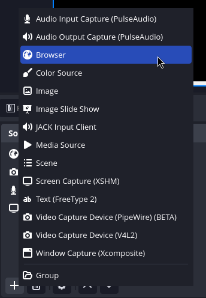
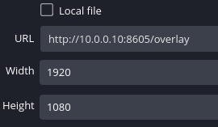

# obs-drops-overlay

A obs-browser-source overlay for playing sounds, music and Videos right in OBS. 
Controlled by a webserver the overlay can be controlled from a tablet or phone.

## Functionality

### Video player
* provides a transparent video player
* when a video ends the overlay becomes transparent
* remote play/pause and seek
* control playbackRate from 0.2 - 2.0 (in 0.2 increments)
* loads local files and urls

### Video Loop
* drop videos can be played while looping video
* plays all videos in videoLoop directory in a loop forever
* loop continues until stop is pressed

### Audio player
* plays mp3 files
* volume control effects all playing sounds

### Music player
* has separate volume control

### Supported Formats

| type  | format  |
|-------|---------|
| audio | mp3     |
| video | mkv mp4 |

## Use

directory tree

```shell
$PWD
  ├─obs-drops-overlay.exe
  └─assets 
      ├─drops  ## audio and video drops
      │   ├─audio-drop0.mp3
      │   ├─audio-drop1.mp3
      │   ├─video-drop0.mkv
      │   └─video-drop1.mp4   
      ├─music  ## music
      │   └─music0.mp3
      └─videoLoop   ## looped video 
          ├─00_video.mp4
          └─01_video.mp4
``` 
* $PWD is the programs root directory 
* audio and video drops go in drops
* I am sure you can figure where music goes

## adding to obs

---

Add a browser source



---

Add the overlay url in console output to browser source in obs (http://xxx.xxx.xxx.xxx:8605/overlay)



# Android

In Android you need to add files through USB connection in the locations shown below

the directories will be created on first run

doing this allows the program not to require any storage permissions 

```shell
/Android/data/codegoy.obs.overlay/files/
  └─assets 
      ├─drops  ## audio and video drops
      │   ├─audio-drop0.mp3
      │   ├─audio-drop1.mp3
      │   ├─video-drop1.mkv
      │   └─video-drop0.mp4   
      └─music  ## music
          └─music0.mp3
      
``` 

also IP address is found in Android settings in "WIFI connection info" or "system info"

the overlay and controller will be at ```http://<your_IP>:8605/control``` and ```http://<your_IP>:8605/overlay```

The app should run in the background until exit is pressed or the card closed in "running apps overview"