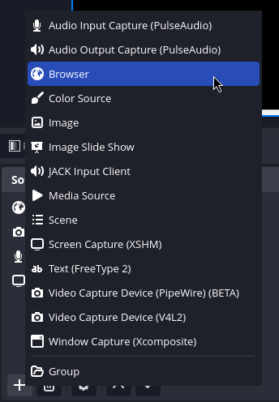
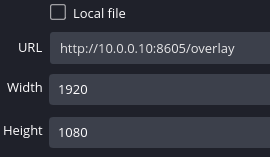

# obs-drops-overlay

A obs-browser-source overlay for playing sounds, music and Videos right in OBS.
Controlled by a webserver the overlay can be controlled from a tablet or phone.

## Functionality

### Systray

```shell
Flags:
  -path string
        override file location
  -port string
        port to listen on (default "8605")
  -systray
        show systray 

```
---
### MIDI control

bind buttons and ranged inputs to MIDI controller buttons and dials

#### use
* click MIDI button
* select MIDI controller
* click element to bind
* On MIDI controller: press button or rotate dial

##### Note

MIDI access requires a valid TLS cert or accessed from localhost ->  http://127.0.0.1:8605/control or http://localhost:8605/control 

##### remote LAN server bypass (chrome, brave, edge)

* in address bar ```chrome://flags/#unsafely-treat-insecure-origin-as-secure```
* add full ip address of the server ``` http://10.0.0.10:8605 ``` to the text area
* enable  "Insecure origins treated as secure"
* restart browser

To my knowledge firefox has no insecure bypass for IP addresses to access MIDI from a remote LAN address.

---

### Video player
* provides a transparent video player
* when a video ends the overlay becomes transparent
* remote play/pause and seek
* control playbackRate from 0.2 - 2.0 (in 0.2 increments)
* loads local files and urls
---

### Video Loop
* drop videos can be played while looping video
* plays all videos in videoLoop directory in a loop forever
* loop continues until stop is pressed

---

### Audio player
* plays mp3 files
* volume control effects all playing sounds

---

### Music player
* has separate volume control

## Supported Formats

| type  | format  |
|-------|---------|
| audio | mp3     |
| video | mkv mp4 |


## Building

```bash
git clone https://github.com/CodeGoy/OBS-drops-overlay.git
cd OBS-drops-overlay/
go mod tidy && go build .
```

## adding to obs

Add a browser source



---

Add the overlay url in console output to browser source in obs (http://xxx.xxx.xxx.xxx:8605/overlay)


